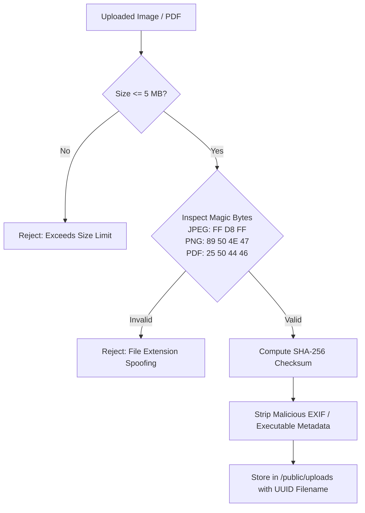

# Greater Chennai Police Portal ("Chennai Guardian")
## Comprehensive Workflow & Operational Specification

> **Classification:** Official Documentation  
> **System Name:** Greater Chennai Police - Commissioner Portal (Chennai Guardian)  
> **Technology Stack:** Next.js 16 (App Router), React 19, TypeScript, Tailwind CSS v4, MySQL Database  
> **Language Support:** English & Tamil (தமிழ்)

---

## 📑 Table of Contents
1. [Executive Summary](#1-executive-summary)
2. [End-to-End System Architecture](#2-end-to-end-system-architecture)
3. [Citizen / Public User Workflow](#3-citizen--public-user-workflow)
   - [3.1 Landing & Accessibility](#31-landing--accessibility)
   - [3.2 Police Station / Precinct Discovery](#32-police-station--precinct-discovery)
   - [3.3 Citizen E-Services & Mobile Phone Tracing](#33-citizen-e-services--mobile-phone-tracing)
   - [3.4 Live Traffic & Weather Advisories](#34-live-traffic--weather-advisories)
   - [3.5 Newsroom, Video Media & Web Stories](#35-newsroom-video-media--web-stories)
   - [3.6 Citizen Grievance & Feedback Dispatch](#36-citizen-grievance--feedback-dispatch)
4. [Administrative & Security Workflow (`/controller`)](#4-administrative--security-workflow-controller)
   - [4.1 Stealth Access & Honeypot Deflection](#41-stealth-access--honeypot-deflection)
   - [4.2 Visual HMAC CAPTCHA Engine](#42-visual-hmac-captcha-engine)
   - [4.3 Credential Verification & Progressive Lockout](#43-credential-verification--progressive-lockout)
   - [4.4 Step-Up TOTP Multi-Factor Authentication (MFA)](#44-step-up-totp-multi-factor-authentication-mfa)
   - [4.5 Secure Session Issuance](#45-secure-session-issuance)
5. [CMS Content Management Lifecycle](#5-cms-content-management-lifecycle)
   - [5.1 Multilingual Article Publishing & AI Assistant](#51-multilingual-article-publishing--ai-assistant)
   - [5.2 Magic-Byte Quarantined File Upload Pipeline](#52-magic-byte-quarantined-file-upload-pipeline)
   - [5.3 Police Station Master Directory Management](#53-police-station-master-directory-management)
   - [5.4 Navigation Menu & Dynamic Page CMS](#54-navigation-menu--dynamic-page-cms)
6. [SuperAdmin Governance & Security Auditing](#6-superadmin-governance--security-auditing)
   - [6.1 Role-Based Access Control (RBAC)](#61-role-based-access-control-rbac)
   - [6.2 Account Lockout Recovery Flow](#62-account-lockout-recovery-flow)
   - [6.3 Security Audit Trail (Activity Logs)](#63-security-audit-trail-activity-logs)
   - [6.4 Database Disaster Recovery & Automated Backups](#64-database-disaster-recovery--automated-backups)
7. [Background Synchronizations & Automated Jobs](#7-background-synchronizations--automated-jobs)
8. [Comprehensive Route & Database Matrix](#8-comprehensive-route--database-matrix)

---

## 1. Executive Summary

The **Greater Chennai Police Portal** provides an integrated digital bridge between the Chennai City Police Department and the public. The system serves two core operational needs:
1. **Public Information & E-Services Portal:** Enables citizens to find jurisdiction police stations with typo-tolerant search, report missing devices, monitor live traffic advisories, access multilingual police news, and submit feedback.
2. **Administrative Control Center (`/controller`):** A multi-layer authenticated CMS allowing authorized officers to publish alerts, manage 103 police station records, review audit logs, and administer user permissions with full audit compliance.

---

## 2. End-to-End System Architecture

```mermaid
flowchart TD
    %% Inbound Request
    Req([HTTP / HTTPS User Request]) --> Proxy[Edge Security Proxy (src/proxy.ts)]

    %% Security Decision Gate
    Proxy --> IsHoneypot{Hits /admin, /dashboard, /backend?}
    IsHoneypot -- Yes --> Trap[Rewrite to 404 Not Found]
    IsHoneypot -- No --> RouteType{Route Classification}

    %% Public Flow
    RouteType -- Public Route --> CPGuard[Client Content Protection Guard]
    CPGuard --> LangEngine[Bilingual Engine (English / Tamil)]
    LangEngine --> PublicViews[Public View Controllers]
    
    PublicViews --> V1[103 Police Stations Finder & Fuzzy Search]
    PublicViews --> V2[Citizen E-Services & Mobile Tracing]
    PublicViews --> V3[Traffic Advisories & Weather Bulletins]
    PublicViews --> V4[Multilingual Newsroom & Web Stories]
    PublicViews --> V5[Feedback & Citizen Grievances]

    %% Admin Flow
    RouteType -- /controller --> Captcha[HMAC Distorted SVG CAPTCHA]
    Captcha --> Creds{Valid Username + Password?}
    Creds -- Fail >= 5 times --> Lockout[Account Locked & Activity Logged]
    Creds -- Valid --> MFAValidation{RFC 6238 TOTP 2FA Verification}
    MFAValidation -- Success --> CookieIssue[Issue HttpOnly + SameSite Cookie]
    
    CookieIssue --> ControllerCMS[Admin CMS Control Center]
    ControllerCMS --> C1[News & Media Editor + Gemini AI]
    ControllerCMS --> C2[Station Directory Manager (103 Stations)]
    ControllerCMS --> C3[Dynamic Menus & Page Builder]
    ControllerCMS --> C4[Quarantined File Upload Pipeline]
    ControllerCMS --> C5[SuperAdmin RBAC & Security Logs]

    %% Persistence
    V1 & V2 & V3 & V4 & V5 & C1 & C2 & C3 & C4 & C5 --> MySQL[(MySQL Database: chennai_guardian)]
```

---

## 3. Citizen / Public User Workflow

```
[Visit Portal] ➡️ [Select Language EN/TA] ➡️ [Search / Consume Services] ➡️ [Submit Request]
```

### 3.1 Landing & Accessibility
1. **Visitor Entry:** Citizen navigates to the portal domain (`/`).
2. **Content Protection Guard:** `ContentProtection.tsx` activates in the browser:
   - Disables unauthorized context-menu copy, cut, and text selection.
   - Blocks DevTools shortcut triggers (`F12`, `Ctrl+Shift+I/J/C`, `Ctrl+U`).
   - Intercepts `PrintScreen` to clear the clipboard buffer.
3. **Bilingual Engine (`LanguageContext`):**
   - Citizen toggles between **English** and **Tamil (தமிழ்)** at any time.
   - Preference is stored in `LocalStorage` and `Cookies`.
   - All navigation labels, titles, dynamic descriptions, and categories render dynamically in the selected language.
4. **Text-to-Speech (TTS):** Visually impaired or auditory learners click the listen icon to stream spoken article audio generated by `/api/tts`.

### 3.2 Police Station / Precinct Discovery (`/stations`)
1. **Search Input:** Citizen types a locality, street, or station name (e.g., *Adyar, Anna Nagar, T. Nagar, Royapettah, Chromepet, Tambaram*).
2. **Levenshtein Typo-Tolerant Algorithm:** Matches the nearest station even if misspelled (e.g., typing *"Valachery"* maps to *Velachery Police Station*).
3. **Station Record Presentation:**
   - **Station Name & Zone:** Shows unit hierarchy (e.g., *E-1 Mylapore Police Station, East Zone*).
   - **Station Contact Info:** Direct Inspector phone number, landline, and emergency extensions.
   - **Jurisdiction Boundary:** List of specific streets, landmarks, and sectors covered.
   - **One-Click Google Maps:** Direct navigation link to the physical station building.

### 3.3 Citizen E-Services & Mobile Phone Tracing (`/citizen-services`)
1. **Official E-Services:** Categorized links to Tamil Nadu Police portals (Online FIR, CSR status, Lost Document Report, Police Verification).
2. **Lost Mobile Tracing Workflow (`/api/trace-mobile`):**
   - Citizen enters IMEI 1, IMEI 2, mobile brand, model, missing date, and last seen locality.
   - Data payload is validated, sanitized, and stored for cyber-cell tracking.

### 3.4 Live Traffic & Weather Advisories (`/traffic`)
1. Citizen views real-time traffic alerts categorized by **High**, **Medium**, and **Low** severity.
2. Information includes road diversions, VIP movement routes, waterlogging reports, and suggested alternate roadways.

### 3.5 Newsroom, Video Media & Web Stories (`/news`, `/videos`, `/stories`)
1. **Breaking News Ticker:** Displays real-time urgent updates across all pages.
2. **Hero Spotlight & Categories:** Filter news by *Crime, Traffic, Public Safety, Welfare, and Community Outreach*.
3. **Video News Center:** Embedded video briefings and press meets with live view counters.
4. **Mobile Web Stories:** Mobile-optimized visual story cards for social media styled updates.

### 3.6 Citizen Grievance & Feedback Dispatch (`/contact-us`, `/api/feedback`)
1. Citizen fills out feedback/grievance form.
2. The payload passes through `sanitizer.ts` (stripping XSS/injection characters).
3. Confirmation message is shown to the user; an automated notification is dispatched via `/api/send-email`.

---

## 4. Administrative & Security Workflow (`/controller`)

```
[/controller] ➡️ [HMAC CAPTCHA] ➡️ [Password Check] ➡️ [TOTP 2FA] ➡️ [Admin Session]
```

### 4.1 Stealth Access & Honeypot Deflection
- Automated scanning bots attempting common paths like `/admin`, `/dashboard`, `/backend`, or `/login/admin` are rewritten by `src/proxy.ts` to `404 Not Found`.
- Administrative officers must enter via the designated `/controller` entry path.

### 4.2 Visual HMAC CAPTCHA Engine (`src/lib/captcha.ts`)
1. Dynamic SVG image is generated with 6 random characters, background noise lines, dots, and character rotations.
2. An HMAC-SHA256 signature token is issued with a **5-minute expiration**.
3. Upon submission, the token is validated and immediately invalidated (single-use registry) to block replay attacks.

### 4.3 Credential Verification & Progressive Lockout
1. The user enters username and password over HTTPS.
2. System checks `users.locked`:
   - If `locked = 1` or `failed_logins >= 5`, access is blocked with HTTP `403 Forbidden`.
3. Password hash is verified using `bcrypt`.
   - On failure: `failed_logins` count is incremented in `users`.
   - On success: `failed_logins` is reset to `0`.

### 4.4 Step-Up TOTP Multi-Factor Authentication (MFA) (`src/lib/totp.ts`)
1. If the user has MFA enrolled, a step-up modal appears requesting a 6-digit TOTP code.
2. The code is verified against the user's secret using the RFC 6238 standard time-window.
3. If MFA is not yet configured, the user is guided through first-time QR code enrollment.

### 4.5 Secure Session Issuance (`src/lib/auth.ts`)
- Upon full authentication, an `admin_session` cookie is issued with:
  - `HttpOnly: true` (inaccessible to client-side scripts)
  - `SameSite: Strict` (CSRF prevention)
  - `Secure: true` (HTTPS only)
- The login event is recorded in `activity_logs` with username, IP address, user-agent, and timestamp.

---

## 5. CMS Content Management Lifecycle

### 5.1 Multilingual Article Publishing & AI Assistant
1. **Editor Input:** Officer writes title, excerpt, and content in both English and Tamil.
2. **AI Content Assistance:**
   - Officer can trigger the **Google Gemini AI** engine.
   - The AI generates SEO meta tags, search keywords, and executive bilingual summaries.
3. **Publishing:** Article is committed to the `news` table and immediately appears on the live public feed.

### 5.2 Magic-Byte Quarantined File Upload Pipeline (`uploadSecurity.ts`)


### 5.3 Police Station Master Directory Management
1. Admin navigates to `/controller/stations`.
2. Admin can create, modify, or delete any of the **103 Police Stations**.
3. Changes to station phone numbers, Inspector names, jurisdictions, or GPS map links reflect instantaneously across the public `/stations` portal.

### 5.4 Navigation Menu & Dynamic Page CMS
1. **Menu Builder:** Drag-and-drop hierarchy builder to reorder header links, attach submenus, or toggle active status.
2. **Dynamic Page Builder (`/page/[slug]`):** Create custom standalone public pages (e.g., *Welfare Schemes, Modernization Wing, Special Bulletins*).

---

## 6. SuperAdmin Governance & Security Auditing

### 6.1 Role-Based Access Control (RBAC)
| Role | Permissions & Access Scope |
| :--- | :--- |
| **`SUPER_ADMIN`** | Full system governance, user provisioning, unlocking accounts, viewing security logs, system backups. |
| **`ADMIN`** | Stations directory management, news approval, traffic advisories, menu builder. |
| **`EDITOR`** | Drafting news articles, uploading verified media, and drafting web stories. |

### 6.2 Account Lockout Recovery Flow
1. Accounts locked by 5 consecutive invalid login attempts are flagged in the database (`users.locked = 1`).
2. A SuperAdmin accesses the **User Management Console** in `/controller/users`.
3. Reviews the lockout timestamp, failure history, and originating IP.
4. Clicks **"Unlock Account"** or resets the user's MFA secret.

### 6.3 Security Audit Trail (`activity_logs`)
- Every administrative transaction is stored permanently in `activity_logs`:
  - `username` & `userRole`
  - `action` (`LOGIN`, `LOGOUT`, `CREATE_ARTICLE`, `UPDATE_STATION`, `DELETE_USER`, etc.)
  - `ipAddress` & `userAgent`
  - `created_at` (ISO timestamp)

### 6.4 Database Disaster Recovery & Automated Backups
- SuperAdmins can trigger SHA-256 verified database exports via `/api/admin/backups`.
- Schema integrity checkers verify relational tables, foreign key constraints, and character encodings.

---

## 7. Background Synchronizations & Automated Jobs

1. **Traffic Advisory Synchronization (`trafficSync.ts`):** Periodically polls external police feeds, deduplicates alerts, and updates live road status.
2. **Dynamic XML Sitemaps:** Automatically serves up-to-date search engine feeds (`/sitemap.xml`, `/news-sitemap.xml`, `/video-sitemap.xml`).
3. **Visitor Analytics Counter:** Aggregates real-time view counts with sliding-window rate limit protection (`/api/analytics/visit`).

---

## 8. Comprehensive Route & Database Matrix

| Route Type | URL Path | Purpose | Database Table(s) |
| :--- | :--- | :--- | :--- |
| **Public** | `/` | Homepage, Hero Carousel, Breaking Ticker | `news`, `alerts`, `menu_items` |
| **Public** | `/stations` | 103 Precincts Finder with Fuzzy Search | `police_stations` |
| **Public** | `/stations/[slug]` | Individual Police Station Profile & Contacts | `police_stations` |
| **Public** | `/traffic` | Live Traffic & Route Diversions | `alerts` |
| **Public** | `/citizen-services` | Online Services & Missing Mobile Tracing | `citizen_services` |
| **Public** | `/news`, `/news/[slug]` | Multilingual Newsroom & Press Notes | `news` |
| **Public** | `/videos`, `/stories` | Video Press Conferences & Web Stories | `videos`, `web_stories` |
| **Public** | `/about`, `/contact-us` | Police Leadership Profiles & Helplines | `police_stations`, `users` |
| **Security** | `/admin`, `/dashboard` | **Honeypot Trap** (Deflected to 404) | `activity_logs` |
| **Admin** | `/controller` | Admin Control Panel & CMS Suite | All Tables |
| **API** | `/api/admin/auth/*` | CAPTCHA, Login, MFA, Password Policies | `users`, `activity_logs` |
| **API** | `/api/admin/crud/[module]` | Universal Sanitized CRUD Engine | Target Module Table |
| **API** | `/api/trace-mobile` | Lost Mobile Phone Registration | `mobile_traces` |
| **API** | `/api/feedback` | Public Grievances & Feedback | `feedback`, `activity_logs` |

---

*Greater Chennai Police Portal Technical Specification Document*
